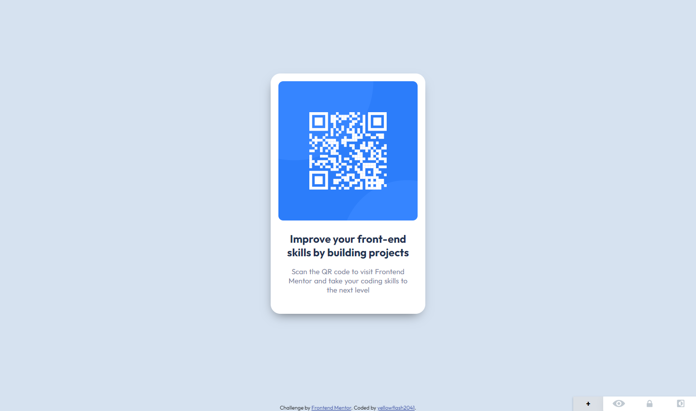

# Frontend Mentor - QR code component solution

This is a solution to the [QR code component challenge on Frontend Mentor](https://www.frontendmentor.io/challenges/qr-code-component-iux_sIO_H). Frontend Mentor challenges help you improve your coding skills by building realistic projects. 

## Table of contents

- [Frontend Mentor - QR code component solution](#frontend-mentor---qr-code-component-solution)
  - [Table of contents](#table-of-contents)
  - [Overview](#overview)
    - [Screenshot](#screenshot)
  - [My process](#my-process)
    - [Built with](#built-with)
    - [What I learned](#what-i-learned)
    - [Continued development](#continued-development)
  - [Author](#author)
  - [Acknowledgments](#acknowledgments)

## Overview

### Screenshot



## My process

### Built with

- Semantic HTML5 markup
- CSS custom properties
- Flexbox
- CSS Grid
- Mobile-first workflow

### What I learned

Use this section to recap over some of your major learnings while working through this project. Writing these out and providing code samples of areas you want to highlight is a great way to reinforce your own knowledge.

To see how you can add code snippets, see below:

```html
<h1>Improve your front-end skills by building projects</h1>
```
```css
.qr-container {
  background-color: var(--white);
  border-radius: 20px;
  box-shadow: -2px 10px 24px -11px rgba(0, 0, 0, .62);
  -webkit-box-shadow: -2px 10px 24px -11px rgba(0, 0, 0, .62);
  -moz-box-shadow: -2px 10px 24px -11px rgba(0, 0, 0, .62);
  display: flex;
  flex-direction: column;
  align-items: center;
  gap: .2rem;
  margin: 5.3rem auto 9.4rem;
  text-align: center;
  width: max(20%, 20rem);
  height: auto;
}
```

### Continued development

Use this section to outline areas that you want to continue focusing on in future projects. These could be concepts you're still not completely comfortable with or techniques you found useful that you want to refine and perfect.

## Author

- Frontend Mentor - [@yellowflash2041](https://www.frontendmentor.io/profile/yellowflash2041)

## Acknowledgments

This is where you can give a hat tip to anyone who helped you out on this project. Perhaps you worked in a team or got some inspiration from someone else's solution. This is the perfect place to give them some credit.
